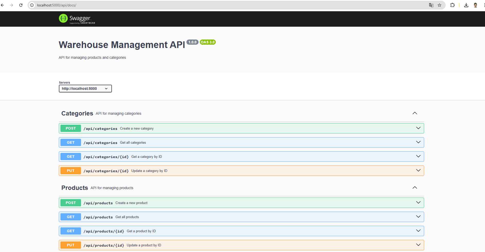

## Домашнее задание: "Реализация CRUD-операций для товаров и категорий на сервере + Защита CRUD-операций для товаров и категорий на сервере посредством авторизации с использованием JWT"

1. Использую MongoDB.
2. Обернул все в Docker.
3. Добавил валидации, логи, мидлвары и свагер.
4. Написал тесты. 

### Тесты
```
Test Suites: 3 passed, 3 total
Tests:       12 passed, 12 total
Snapshots:   0 total
Time:        13.184 s, estimated 18 s
```

### Swagger


